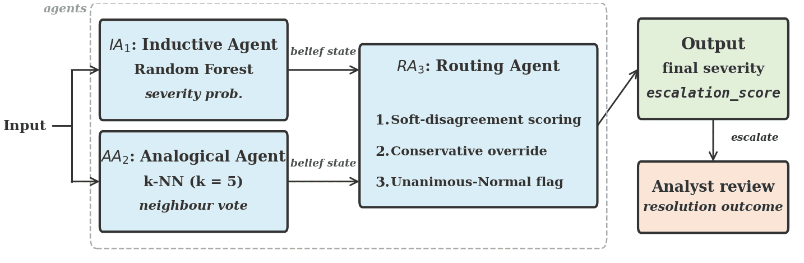

# Harnessing Disagreement: Detecting Correlated Agreement Blindness in Multi-Agent Triage

A Reproducibility package.  
Every number in the manuscript can be regenerated from this repository.



## 1. Installation

```bash
git clone https://github.com/Shay636/arat-paper.git
cd arat-paper
python -m venv .venv && source .venv/bin/activate
pip install -r requirements.txt
```

**Python ≥ 3.9** required. No GPU needed.

## 2. Data

Raw data is **not** included (licence restrictions). Download automatically:

```bash
python data/fetch_data.py
```

This places the official UNSW-NB15 train/test CSVs into `data/unsw_nb15/`
and the Diabetes 130-US Hospitals readmission data (UCI 296) into `data/diabetes/`.
See `data/README.md` for manual download instructions if the script fails.

| Dataset | Train | Test | Classes | Source |
|---------|-------|------|---------|--------|
| UNSW-NB15 | 175,341 | 82,332 | 4 severity levels | [UNSW](https://research.unsw.edu.au/projects/unsw-nb15-dataset) |
| Diabetes 130-US Hospitals | 81,412 (80%) | 20,354 (20%) | 3 ordinal levels | [UCI](https://archive.ics.uci.edu/dataset/296/diabetes+130-us+hospitals+for+years+1999-2008) |

## 3. Reproduce All Results

Run scripts in order (or use the convenience wrapper):

```bash
# Option A: one command
bash reproduce.sh

# Option B: step by step
python data/fetch_data.py              # Download datasets
python src/run_unsw.py                 # Tables 1–2, θ sweep, hi-sev, CIs, figure  (~4 min)
python src/run_unsw_baselines.py       # Baseline comparison table                  (~5 min)
python src/run_unsw_ablation.py        # Table 3: v1 vs v2 ablation                 (~6 min)
python src/run_diabetes.py             # Diabetes validation                        (~2 min)
python src/run_svm_substitution.py     # SVM agent substitution (robustness)        (~15 min)
```

**Total wall-clock: ~35 minutes** on a 4-core laptop (dominated by SVM + RF training).

## 4. Outputs

All outputs are written to `results/` and `figures/`.
Pre-computed results are committed for inspection without re-running.

| Output file | Corresponds to |
|-------------|---------------|
| `results/table1_routing_strategies.csv` | Table 1 |
| `results/table2_error_dependence.csv` | Table 2 |
| `results/table3_ablation.csv` | Table 3 |
| `results/baselines_full_comparison.csv` | Full baseline comparison (§6) |
| `results/theta_sweep_results.csv` | §6.4 safety-flag θ sweep |
| `results/confidence_intervals.csv` | §6.5 CIs |
| `results/high_severity_unan_normal_analysis.json` | §7 discussion |
| `results/all_results.json` | All metrics in one file |
| `results/diabetes_results.json` | Table 4: Diabetes validation |
| `results/svm_substitution_results.json` | SVM agent robustness (§6.6) |
| `figures/confusion_matrix.pdf` | Figure 1 |


## 5. Repository Structure

```
arat-paper/
├── README.md                  ← you are here
├── LICENSE                    ← MIT
├── CITATION.cff               ← citation metadata
├── requirements.txt           ← pip dependencies
├── reproduce.sh               ← one-command full reproduction
├── .gitignore
├── data/
│   ├── README.md              ← manual download instructions
│   └── fetch_data.py          ← automated download
├── src/
│   ├── run_unsw.py            ← Tables 1–2, θ sweep, hi-sev, CIs, confusion matrix
│   ├── run_unsw_baselines.py  ← all baselines + ARAT comparison
│   ├── run_unsw_ablation.py   ← v1 vs v2 configuration ablation
│   ├── run_diabetes.py        ← Diabetes validation
│   └── run_svm_substitution.py ← SVM agent substitution (robustness)
├── results/                   ← committed outputs (CSVs + JSON)
└── figures/                   ← committed figures (PDF)
```

Each `src/` script is **self-contained** — no shared library, no config files,
no package installation beyond `requirements.txt`.


## 6. Hardware & Reproducibility Notes

- Experiments were developed on Azure Databricks (serverless) and validated
  locally on a 4-core/16 GB laptop.
- All random seeds are fixed (`SEED = 42`). Results are deterministic on a
  given platform; minor floating-point differences may occur across OS/BLAS.
- scikit-learn's `n_jobs=-1` parallelises RF/kNN; reduce if memory-constrained.
- The SVM substitution experiment trains on a 30k stratified subsample
  for tractability; predictions are evaluated on the full test set.


## License

MIT — see `LICENSE`.
