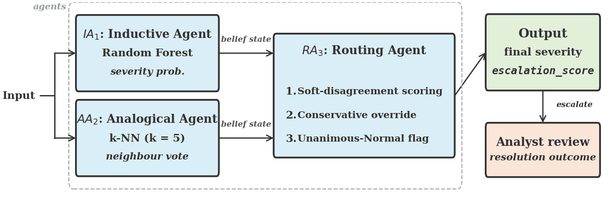

# Harnessing Disagreement: Detecting Correlated Agreement Blindness in Multi-Agent Triage

A Reproducibility package.  
Every number in the manuscript can be regenerated from this repository. ARAT
(Arbitrated Reasoning Agents for Alarm Triage) routes between a Random Forest (RF)
and a k-nearest-neighbour (k-NN) predictive agent. The repository also covers support
vector machine (SVM) substitution and uncertainty quantification (UQ) baselines.



## 1. Installation

```bash
git clone https://github.com/McDonnelletal/arat-paper.git
cd arat-paper
python -m venv .venv && source .venv/bin/activate
pip install -r requirements.txt
```

**Python ≥ 3.9** required. No GPU needed.

## 2. Data

Raw data is **not** included (licence restrictions). Download automatically:

```bash
python data/fetch_data.py
```

This places the official UNSW-NB15 train/test CSVs into `data/unsw_nb15/`
and the Diabetes 130-US Hospitals readmission data (UCI 296) into `data/diabetes/`.
See `data/README.md` for manual download instructions if the script fails.

| Dataset | Train | Test | Classes | Source |
|---------|-------|------|---------|--------|
| UNSW-NB15 | 175,341 | 82,332 | 4 severity levels | [UNSW](https://research.unsw.edu.au/projects/unsw-nb15-dataset) |
| Diabetes 130-US Hospitals | 81,412 (80%) | 20,354 (20%) | 3 ordinal levels | [UCI](https://archive.ics.uci.edu/dataset/296/diabetes+130-us+hospitals+for+years+1999-2008) |
| TCGA pathology reports (LLM committee, §6.7) | n/a | 6,112 | 4 cancer stages (AJCC) | TCGA-Reports + TCGA-CDR (see `data/README.md`) |

The large language model (LLM) committee (§6.7) assigns the American Joint Committee
on Cancer (AJCC) stage to pathology reports from The Cancer Genome Atlas (TCGA). It is
handled differently from the two classical datasets: its per-report soft-probabilities
are committed under `results/llm_committee/`, so the committee table reproduces on CPU
with no model inference. The raw TCGA reports are needed only to rebuild that CSV from
scratch, via `src/llm_committee/prep_tcga_stage.py`. The source datasets are
TCGA-Reports (report text) and the TCGA Clinical Data Resource (TCGA-CDR; stage
labels); see `data/README.md`.

## 3. Reproduce All Results

Run scripts in order (or use the convenience wrapper):

```bash
# Option A: one command
bash reproduce.sh

# Option B: step by step
python data/fetch_data.py              # Download datasets
python src/run_unsw.py                 # Table 1 + error dependence (§6.2), θ sweep, hi-sev, CIs, Fig 2
python src/run_unsw_baselines.py       # Baseline comparison, Table 1
python src/run_unsw_ablation.py        # Table 2: v1 vs v2 RF-config ablation (UNSW)
python src/run_diabetes.py             # Diabetes validation (§6.5)
python src/run_diabetes_ablation.py    # Diabetes RF-config ablation (Table 2 cols)
python src/run_svm_substitution.py     # SVM agent substitution, §6.5 (robustness)
python src/run_pair_sweep.py           # Table 3: base-learner pair sweep (R1)
python src/run_conformal_baseline.py   # Table 4: single-model UQ vs ARAT (R3)
python src/llm_committee/fill_table.py \
    --large results/llm_committee/TCGAStage_crossfamily_large.csv  # LLM committee table (§6.7)
```

## 4. Outputs

All outputs are written to `results/` and `figures/`.
Pre-computed results are committed for inspection without re-running.

| Output file | Corresponds to |
|-------------|----------------|
| **Tables and figures** | |
| `results/table1_routing_strategies.csv` | Table 1 (routing strategies) |
| `results/baselines_full_comparison.csv` | Table 1 (full baseline comparison, §6.1) |
| `results/table3_ablation.csv` | Table 2 (RF-config ablation, UNSW columns) |
| `results/diabetes_ablation.json` | Table 2 (RF-config ablation, Diabetes columns) |
| `results/pair_sweep_results.json` (+ `_table.tex`) | Table 3 (base-learner pair sweep, R1) |
| `results/uq_baseline_results.json` (+ `_table.tex`) | Table 4 (single-model UQ vs ARAT, R3) |
| `figures/confusion_matrix.pdf` | Figure 2 (ARAT confusion matrix) |
| **Supporting results (by section)** | |
| `results/table2_error_dependence.csv` | §6.2 error-dependence stats (prose in final paper) |
| `results/theta_sweep_results.csv` | §6.3 safety-flag θ sensitivity (θ defined in §4.3) |
| `results/diabetes_results.json` | §6.5 Diabetes validation (v2 config) |
| `results/diabetes_v1_results.json` | §6.5 Diabetes v1 ablation (full-precision record) |
| `results/svm_substitution_results.json` | §6.5 SVM agent substitution |
| `results/llm_committee/TCGAStage_crossfamily_large.csv` | §6.7 LLM committee soft-probs (fill with `fill_table.py`) |
| `results/confidence_intervals.csv` | §7.1 Clopper-Pearson intervals (Table 1 CP column) |
| `results/high_severity_unan_normal_analysis.json` | §7.1 agreement-ceiling analysis |
| **Combined** | |
| `results/all_results.json` | All metrics in one file |


## 5. Repository Structure

```
arat-paper/
├── README.md                  ← you are here
├── LICENSE                    ← MIT
├── requirements.txt           ← pip dependencies
├── reproduce.sh               ← one-command full reproduction
├── .gitignore
├── data/
│   ├── README.md              ← manual download instructions
│   └── fetch_data.py          ← automated download
├── src/
│   ├── run_unsw.py            ← Table 1 + §6.2 stats, θ sweep, hi-sev, CIs, confusion matrix
│   ├── run_unsw_baselines.py  ← all baselines + ARAT comparison
│   ├── run_unsw_ablation.py   ← Table 2: v1 vs v2 RF-config ablation
│   ├── run_diabetes.py        ← Diabetes validation (§6.5)
│   ├── run_diabetes_ablation.py ← Diabetes RF-config ablation (Table 2, Diabetes cols)
│   ├── run_svm_substitution.py ← SVM agent substitution (§6.5)
│   ├── run_pair_sweep.py       ← Table 3: base-learner pair sweep (R1)
│   ├── run_conformal_baseline.py ← Table 4: single-model UQ vs ARAT (R3)
│   └── llm_committee/    ← cross-family LLM committee on TCGA staging (§6.7)
├── results/                   ← committed outputs (CSVs + JSON)
└── figures/                   ← committed figures (PDF)
```

Each top-level `src/` script is **self-contained** — no shared library, no config
files, nothing beyond `requirements.txt`. The `llm_committee/` folder is
likewise self-contained: it ships the committed soft-probabilities plus the routing
code that regenerates the committee table on CPU (see that folder's `README.md`).


## 6. Hardware & Reproducibility Notes

- Experiments were developed on Azure Databricks (serverless) and validated
  locally on a 4-core/16 GB laptop.
- All random seeds are fixed (`SEED = 42`). Results are deterministic on a
  given platform; minor floating-point differences may occur across OS/BLAS.
- scikit-learn's `n_jobs=-1` parallelises RF/k-NN; reduce if memory-constrained.
- The UNSW-NB15 SVM substitution trains on a 30k stratified subsample for
  tractability; the Diabetes SVM trains on the full 81k set (a subsample
  understates the RF/SVM error convergence). Both are evaluated on the full test set.
- Re-runs on a different library stack reproduce the committed artifacts to
  within third-decimal drift (phi shifts by ~0.002, rates by <0.05pp). The
  paper's Table 3 RF + k-NN (main) row cites the main-run artifacts
  (`table2_error_dependence.csv`, `baselines_full_comparison.csv`,
  `svm_substitution_results.json`) so that the paper's Tables 1-3 are mutually
  consistent; `results/pair_sweep_results.json` holds this sweep's own re-run
  of that pair, which differs in the third decimal.

## 7. Method Notes (paper Sec. 4-5 -> code)

- **Soft-disagreement score (Sec. 4.3).** The paper describes arbitration via
  `c = 0.5*H(p_merged) + 0.5*d`. The code realises the score's two components
  directly rather than thresholding `c`: the disagreement component `d` fires
  the conservative override, and the entropy component `H` drives the
  unanimous-Normal safety flag; queue ordering (the `escalation_score` of
  Fig. 1) is the held-out XGBoost router's probability. The published numbers
  come from these deterministic layers, so all results regenerate without a
  standalone `c`. The asymmetric-weighting robustness statement (0.3/0.7
  alternatives within 0.1pp) was established in the original development
  environment and has no committed sweep artifact.
- **Feature selection (Sec. 5).** The paper's "noisy features removed by an F1
  sweep" refers to the original development pass that pruned 37 -> 30 features;
  the committed pipeline reproduces the same 30-feature set with the fixed
  mutual-information rule (`MI > 0.01`, top 30) in `run_unsw.py`.
- **Table 4 ARAT cells.** ARAT's recall at both budgets and its 15%-budget
  residual under-prediction come from `run_unsw.py`'s held-out escalation
  block (3-seed means; `escalation` section of `results/all_results.json`).
  The 15% residual under applies the full routing: override + mandatory safety
  flag + router top-up to the budget, escalated cases assumed resolved (the
  same semantics as the UQ baselines' residual-under column).
- **Diabetes escalation (Sec. 6.5).** `run_diabetes.py` trains the identical
  held-out XGBoost router on Diabetes (no router number is printed in the
  paper); its recall@15% of ~34% vs ~94% on UNSW-NB15 quantifies the paper's
  "smaller escalation leverage" statement.

## License

MIT — see `LICENSE`.
